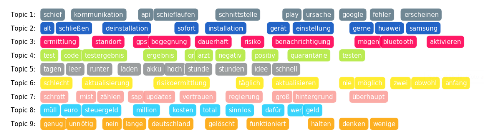
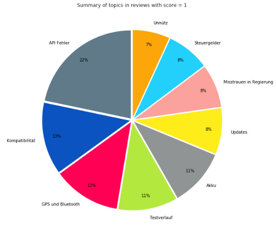

# CoronaWarnApp_TopicModeling 😷🦠📱
Erklärtes Ziel der Corona-Warn-App ist es unter Wahrung der Privatsphäre dabei zu helfen, Infektionsketten nachzuverfolgen und schnell zu unterbrechen. Davor, aber auch im Zuge ihres Releases im Google Play Store hat sie viele Befürworter, aber auch Gegenstimmen gewonnen. Um Infektionen möglichst flächendeckend zu verhindern, ist es wichtig, dass möglichst viele Nutzer:innen sie langfristig nutzen. Um dieser Aufgabe gerecht zu werden, ist es daher notwendig, Beschwerden ("App-Reviews") Gehör zu verschaffen, um Fehler, Bugs und andere Unzunehmlichkeiten, die die Nutzung der App wenig attraktiv gestalten, zu verhindern. Hier sollen mithilfe von Topic Modeling, Themen herausgearbeitet werden, die sich aus den Reviews mit einer schlechten Bewertung ("1" von "1" bis "5") ergeben, um nutzerspezifische Bedürfnisse zu addressieren.

